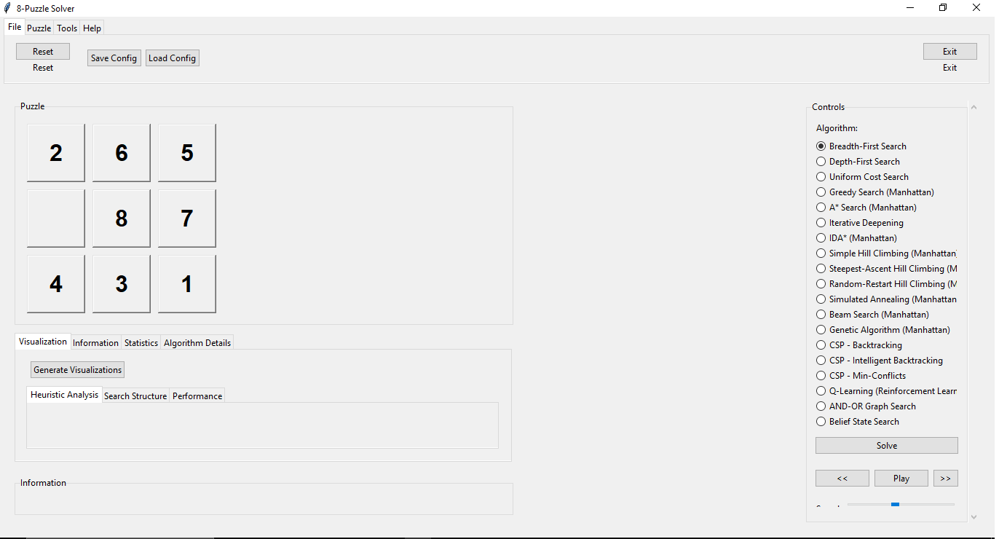
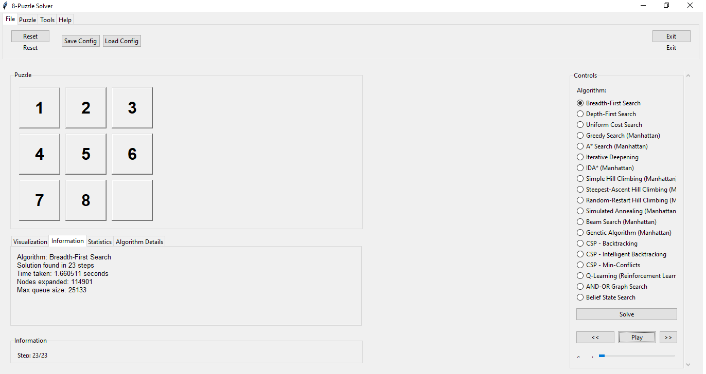
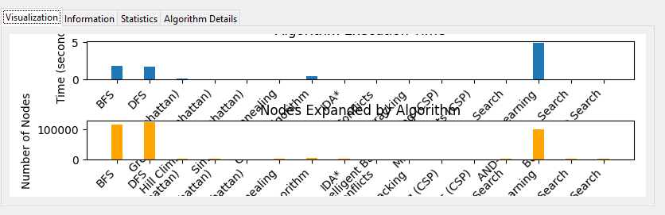
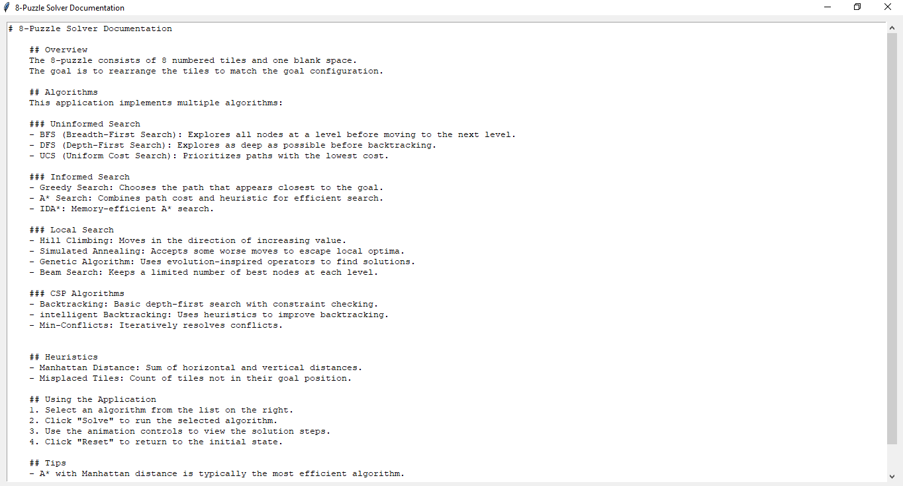

# AI_PersonalProject

Dự án cá nhân môn Trí Tuệ Nhân Tạo (AI)  
**Đề tài:** Giải game 8-Puzzle bằng thuật toán  
**Sinh viên:** Đỗ Kiến Hưng  
**MSSV:** 23133030

[🔗 GitHub Repository](https://github.com/darktheDE/AI_PersonalProject)

---

## Giới thiệu

Đây là dự án bài tập cá nhân cho môn học AI tại HCMUTE. Dự án bao gồm mã nguồn, báo cáo, hình ảnh và video minh họa quá trình thực hiện giải bài toán 8-Puzzle bằng nhiều thuật toán khác nhau.

## Cách chạy chương trình

1. Cài đặt Python 3.x.
2. Mở terminal/cmd tại thư mục dự án.
3. Chạy lệnh sau để thực thi chương trình:
   ```sh
   python main.py
   ```
   hoặc
   ```sh
   python3 main.py
   ```

## Cấu trúc thư mục

- `main.py`: Tập tin chạy chính của dự án.
- `sources/DoKienHung_23133030_BTCN_Code.py`: Mã nguồn chính.
- `pics/`: Thư mục chứa các hình ảnh minh họa.
- `gif/`: Thư mục chứa các file gif mô phỏng thuật toán.
- `algoRecord/`: Thư mục chứa video ghi lại quá trình chạy thuật toán.
- `report/`: Thư mục chứa báo cáo và dữ liệu.

---

## Hình ảnh minh họa

### Tổng quan dự án


### Giao diện chính


### Thuật toán BFS


### Biểu đồ kết quả


### Benchmark 01


### Benchmark 02


### Tài liệu hướng dẫn


---

## Mô phỏng các thuật toán giải 8-Puzzle (GIF)

### AND-OR Search

> Thuật toán AND-OR Search giải quyết bài toán bằng cách xây dựng cây tìm kiếm với các nút AND và OR, phù hợp cho các bài toán có nhiều trạng thái mục tiêu hoặc điều kiện rẽ nhánh.

### A* (A-Star)

> Thuật toán A* sử dụng hàm đánh giá f(n) = g(n) + h(n) để tìm đường đi ngắn nhất, kết hợp chi phí thực tế và ước lượng còn lại đến đích.

### Backtracking

> Thuật toán Backtracking thử từng bước di chuyển, quay lui khi gặp ngõ cụt, đảm bảo tìm ra lời giải nếu tồn tại.

### Beam Search

> Beam Search chỉ giữ lại một số lượng giới hạn các trạng thái tốt nhất ở mỗi bước, giúp giảm bộ nhớ nhưng có thể bỏ lỡ lời giải tối ưu.

### Belief State Search

> Thuật toán này mở rộng tìm kiếm trạng thái dựa trên tập hợp các trạng thái có thể, phù hợp với các bài toán không xác định hoàn toàn.

### BFS (Breadth-First Search)

> BFS duyệt theo từng lớp, đảm bảo tìm ra lời giải ngắn nhất nhưng tiêu tốn nhiều bộ nhớ cho các trạng thái trung gian.

### DFS (Depth-First Search)

> DFS đi sâu vào từng nhánh trước, có thể nhanh nhưng không đảm bảo tìm ra lời giải ngắn nhất.

### Genetic Algorithm

> Thuật toán di truyền mô phỏng quá trình tiến hóa tự nhiên, sử dụng các phép lai ghép và đột biến để tìm lời giải tối ưu.

### Greedy Search

> Greedy Search luôn chọn bước đi có chi phí ước lượng thấp nhất, nhanh nhưng dễ mắc kẹt ở trạng thái cục bộ.

### IDA* (Iterative Deepening A*)

> IDA* kết hợp DFS với A*, lặp lại tìm kiếm với ngưỡng chi phí tăng dần, tiết kiệm bộ nhớ hơn A*.

### Intelligent Backtracking

> Cải tiến từ Backtracking, thuật toán này ghi nhớ các trạng thái đã thử để tránh lặp lại, tăng hiệu quả tìm kiếm.

### Iterative Deepening

> Kết hợp ưu điểm của BFS và DFS, thuật toán lặp lại DFS với độ sâu tăng dần cho đến khi tìm được lời giải.

### Min-Conflict

> Thuật toán này chọn bước đi làm giảm số lượng xung đột nhất, thường dùng cho các bài toán ràng buộc.

### Q-Learning

> Q-Learning là thuật toán học tăng cường, cập nhật giá trị Q cho từng trạng thái-hành động để tối ưu hóa đường đi.

### Random-Restart Hill Climbing

> Thuật toán leo đồi với khởi tạo lại ngẫu nhiên khi mắc kẹt ở cực trị cục bộ, tăng khả năng tìm lời giải toàn cục.

### Simple Hill Climbing

> Leo đồi đơn giản luôn chọn bước đi tốt hơn hiện tại, dễ mắc kẹt ở cực trị cục bộ.

### Steepest-Ascent Hill Climbing

> Ở mỗi bước, thuật toán chọn bước đi cải thiện tốt nhất, giúp tăng khả năng thoát khỏi cực trị cục bộ hơn so với leo đồi đơn giản.

### UCS (Uniform Cost Search)

> UCS mở rộng nút có chi phí thấp nhất trước, đảm bảo tìm ra đường đi tối ưu nếu chi phí các bước là dương.

---

## Báo cáo

Báo cáo chi tiết và video minh họa nằm trong thư mục `report/`:
- `23133030_DoKienHung_BaoCao_BTCN.pdf`: Báo cáo chi tiết.
- `VideoReport.mkv`: Video trình bày dự án.

---

Mọi thắc mắc vui lòng liên hệ: 23133030@student.hcmute.edu.vn