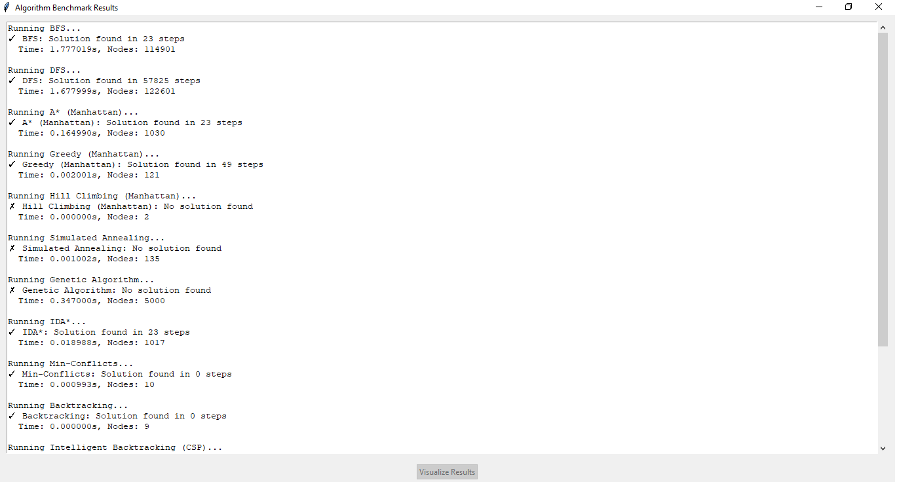

# AI_PersonalProject

Dự án cá nhân môn Trí Tuệ Nhân Tạo (AI)  
Sinh viên: Đỗ Kiến Hưng  
MSSV: 23133030

## Giới thiệu

Đây là dự án cá nhân cho môn học AI tại HCMUTE. Dự án bao gồm mã nguồn, báo cáo và các hình ảnh minh họa quá trình thực hiện.

## Cách chạy chương trình

1. Cài đặt Python 3.x.
2. Mở terminal/cmd tại thư mục dự án.
3. Chạy lệnh sau để thực thi chương trình:
   ```sh
   python main.py
   ```
   hoặc
   ```sh
   python3 main.py
   ```

## Cấu trúc thư mục

- `main.py`: Tập tin chạy chính của dự án.
- `sources/DoKienHung_23133030_tuan15_Code.py`: Mã nguồn chính.
- `pics/`: Thư mục chứa các hình ảnh minh họa.
- `report/`: Thư mục chứa báo cáo và dữ liệu.

## Hình ảnh minh họa

### Tổng quan dự án


### Giao diện chính


### Thuật toán BFS


### Biểu đồ kết quả


### Benchmark 01


### Benchmark 02


### Tài liệu hướng dẫn


## Báo cáo

Báo cáo chi tiết nằm trong thư mục `report/`.

---

Mọi thắc mắc vui lòng liên hệ: 23133030@student.hcmute.edu.vn